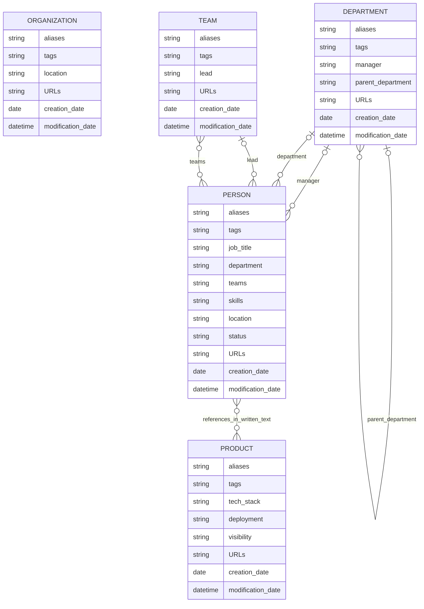

# Ego Network

<!-- GIF / MP4 of sample data exploration -->

At a certain point in an software engineer's carreer there comes the point where you realize that it's no longer just about tech, code and architecture but more about people. Having a strong network of supporters, experts and authoritive figures becomes your safety net, your accelerator and thus your most powerful asset.

At the same time however it becomes increasingly difficult to keep track of your [Ego Network](https://faculty.ucr.edu/~hanneman/nettext/C9_Ego_networks.html). You meet more people, get insights into more products within the company, people leave or switch positions and suddenly you are overwhelmed by the sheer amount of information you need to keep in your head. That's where [Obsidian](https://obsidian.md/) comes to your rescue!

This repo contains an Obsidian based setup to construct your own ego network to fuel your daily work.

## "Building your second brain"

The given templates available in the [templates directory](https://github.com/TrisNol/ego-network/tree/main/templates) create the following data model:

<!-- - Largely inspired by [thephm/hal_md](https://github.com/thephm/hal_md/) -->
<!-- - Requires the [datacore](https://community.obsidian.md/plugins/datacore) plugin used to auto-generate parts of the content based on the document properties -->

!!! warning "Templater required"
	These templates use the [Templater](https://github.com/SilentVoid13/Templater) community plugin for dynamic content. Install it from Obsidian's Community plugins directory and enable it before creating documents from these templates.

1. Import the templates
2. Create directories
3. Use templates to generate documents
4. Fine-tune & explore

<!-- ## Analytics

- How to build a nice graph (e.g. groups, coloring, etc.)
- How to query the network (e.g. contacts for a specific product/topic/tech stack) -->
